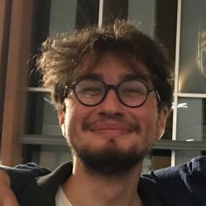

 [Inanç Birol](https://www.bcgsc.ca/people/inanc-birol), principal investigator   
 [René L Warren](https://www.bcgsc.ca/people/rene-warren), group leader   
 Lauren Coombe, assistant bioinformatics coordinator   
 Monica Kotkoff, project manager  

### Antimicrobial Research Lab
 Anat Yanai, research associate 2020- 
 Lia Richter, co-op student (UBC) 2022, student researcher 2023- 
 Darcy Sutherland, graduate student (UBC) 2018- 
 Ali Salehi, co-op / directed studies student (UBC) 2023-24, graduate student 2024- 
 [Berke Ucar](https://berkeucar.github.io), graduate student (UBC) 2023- 
 Emre Demirsoy, graduate student (UBC) 2023- 

### Bioinformatics Technology Lab 
 Readman Chiu, production coordinator  
 Saber Hafezqorani, graduate student (UBC) 2017- 
 Johnathan Wong, graduate student (UBC) 2022- 
 [Amirhossein Afshinfard](member/aafshinfard), graduate student (UBC) 2018- 
[Parham Kazemi](https://parham-k.github.io), graduate student (UBC) 2021- 
Emily Zhang, co-op student (UBC) 2023, directed-studies / graduate student 2024- 
Taghrid Aloraini, graduate student (UBC) 2023- 
Mercan Deniz, student volunteer 2024 

### Alumni
Hossein Ebrahimikondori, graduate student (UBC) 2021-2024 
Chenkai Li, graduate student (UBC) 2017-2023 
Irem Yucel, graduate student (UBC) 2022-2023 
Theodora Lo, co-op student (UBC) 2019-2020, graduate student (UBC) 2020-2023 
Armaghan Sarvar, graduate student (UBC) 2021-23 
Kyle Jenkins, graduate student (UBC) 2020-23 
Cecilia Yang, graduate student (UBC) 2020-23 
Moustafa Shokrof, visiting graduate student (UC Davis) 2022-23 
Talha Murathan Goktas, graduate student (UBC) 2021-23 
Ka Ming Nip, co-op student (UBC) 2010, computational biologist 2011-14, graduate student (UBC) 2014-23 
Nila Erturk, summer intern (UofT) 2022 
Vladimir Nikolic, graduate student (UBC) / research programmer 2019-22 
Janet Li, graduate student (UBC) 2019-22 
Nathan Louie, co-op student (UBC) 2021-22 
Kristina Gagalova, graduate student (UBC) 2017-2022 
Diana Lin, graduate student (UBC) 2018-2022 
Chen Yang, graduate student (UBC) / PDF 2014-22 
Puneet Sidhu, co-op student (UBC) 2021 
Rui Wang, GSAT rotation student (UBC) 2021 
Kristina Wright, graduate student (UBC) 2019-2021 
Sina Jafarzadeh, (UBC directed study student) 2021 
Sambina Islam Aninta, coop student (UBC) 2020-21 
Jacky Yiu, co-op student (SFU) 2020-21 
Yee Fay Lim, graduate student (UBC) 2017-21 
Kyle Jenkins, graduate student (UBC GSAT - rotation) 2020 
Maria Stephenson, co-op student (UBC) 2020 
Justin Chu, graduate student (UBC) / PDF 2014-20 
Figali Taho, graduate student (UBC) 2018-20 
Iris Caglayan, summer intern 2020 
Golnar Sheikhshab, graduate student (SFU) 2014-20 
Alex Marr, GSAT rotation student (UBC) 2019 
Talha Murathan Goktas, intern (Bilkent University, Turkey) 2019 
Hamid Mohamadi, graduate student (UBC) / Research associate 2012-19 
Gokce Dilek, co-op student (UBC) 2019 
Yaman Malkoc, co-op student (UBC) 2019 
Jane Lee, volunteer (UBC) 2019 
Shaun Jackman, bioinformatician 2007-12 / graduate student (UBC) 2012-19 
Jessica Zhang, co-op student (UBC) 2017-19 
Eric Chen, honor's project student / directed studies student (UBC) 2018-19 
Zhuyi Xue, computational biologist 2014-19 
Sauparna Palchowdhury, research programmer 2019 
Lieke Janssen, intern (HAN University of Applied Sciences, The Netherlands) 2018-19 
S. Austin Hammond, computational biologist 2015-19 
Ben Vandervalk, computational biologist 2013-18 
Jeffrey Tse, co-op student (UBC) 2018 
Daniel MacMillan, computational biologist 2015-18 
Emre Erhan, honours project student (UBC) 2017-18 
Jessica Ma, co-op student (UBC) 2018 
Johnathan Wong, co-op student (UBC) 2016-17 
Hamza Khan, graduate student (UBC) 2015-17 
Kyle Lesack, graduate student (UBC) 2014-17 
Erdi Kucuk, graduate student (UBC) 2013-17 
Sarah Yeo, honor's project student / intern / directed studies student (UBC) 2016-17 
Djallel Bouneffouf, postdoctoral fellow 2014-17 
Ewan Gibb, staff scientist 2015-16 
Jessica Pilsworth, graduate student (UBC) 2013-16 
Abdur Rahman M.A. Basher, graduate student (UBC) 2013-15 
Victoria Stuart, computational biologist 2014-15 
Bahar Behsaz, computational biologist 2013-15 
Jorge Lazo, co-op student (UBC) 2015 
Yi-Ming Sun, co-op student (UVic) 2014-15 
Albert Lagman, co-op student (UBC) 2015 
Karthika Raghavan, postdoctoral fellow 2014-15 
Nathan Nastili, co-op student (SFU) 2014 
Alex Purdy, co-op student (UVic) 2014 
Tony Raymond, co-op student (UBC) 2009, computational biologist 2011-14 
Daniel Paulino, co-op student (SFU) 2014 
Mimi Ko, co-op student (UBC) 2013-14 
