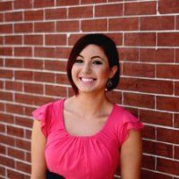
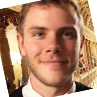

 **Inanc Birol, Principal Investigator**  
 **[Rene Warren](member/renewarren), Group Leader**  
 **Readman Chiu, Production Coordinator**  
 **Sinead Aherne, Project Manager**

### Clinical Bioinformatics

 S. Austin Hammond, computational biologist  
 Zhuyi Xue, computational biologist  
 Daniel MacMillan, computational biologist  
 Chen Yang, graduate student (UBC)  
 Ka Ming Nip, graduate student (UBC)  
 Golnar Sheikhshab, graduate student (UBC)  
 Jessica Ma, coop student (UBC)  
 Emre Erhan, honours project student (SFU)  

### High Performance Computing
 Ben Vandervalk, computational biologist  
 Lauren Coombe, computational biologist  
 Hamid Mohamadi, postdoctoral fellow  
 Justin Chu, graduate student (UBC)  
 [Shaun Jackman](member/shaunjackman), graduate student (UBC)  
 Kristina Gagalova, graduate student (UBC)  
 Yee Fay Lim, graduate student (UBC)  
 Saber Hafezqorani, graduate student (UBC)  
 Chenkai Li, graduate student (UBC)  
 Jeffrey Tse, coop student (UBC)

### Alumni
Jessica Zhang, intern (UBC)  
Ewan Gibb, staff scientist  
Hamza Khan, graduate student (UBC)  
Erdi Kucuk, graduate student (UBC)  
Sarah Yeo, UBC honor's project student / intern / directed studies student (UBC)  
Djallel Bouneffouf, postdoctoral fellow  
Abdur Rahman Basher, UBC graduate student (UBC)  
Victoria Stuart, computational biologist  
Jessica Pilsworth, graduate student (UBC)  
Bahar Behsaz, computational biologist  
Yi-Ming Sun, coop student (UVic)  
Nathan Nastilli, coop student (SFU)  
Alex Purdy, coop student (UVic)  
Golnaz Jahesh, graduate student (UBC)  
Karthika Raghavan, postdoctoral fellow  
Tony Raymond, computational biologist  
Albert Lagman, coop student (UBC)  
Daniel Paulino, coop student (SFU)  
Mimi Ko, coop student (UBC)  
