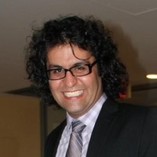
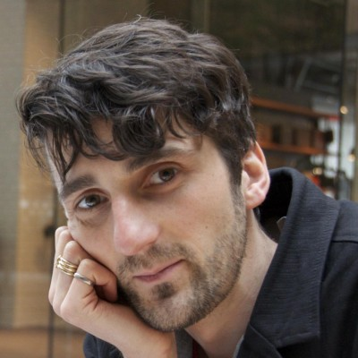
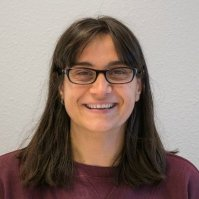
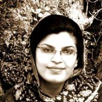
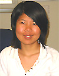

 **Inanç Birol, Principal Investigator**   
 **[René Warren](member/rwarren), Group Leader**   
 **Readman Chiu, Production Coordinator**   
 **Hamid Mohamadi, Research Associate**   
 **Seetha Kumaran, Project Manager** 

### Clinical Bioinformatics

 Chen Yang, graduate student (UBC)   
 Ka Ming Nip, graduate student (UBC)   
 Chenkai Li, graduate student (UBC) 
 Saber Hafezqorani, graduate student (UBC) 
 Figali Taho, graduate student (UBC) 
 Darcy Sutherland, graduate student (UBC) 
 Diana Lin, graduate student (UBC) 

### High Performance Computing

 Lauren Coombe, computational biologist   
 Justin Chu, graduate student (UBC)   
 [Shaun Jackman](member/sjackman), graduate student (UBC)   
 [Kristina Gagalova](member/kgagalova), graduate student (UBC)   
 Golnar Sheikhshab, graduate student (UBC) 
 Yee Fay Lim, graduate student (UBC) 
 Vladimir Nikolić, graduate student (UBC) 
 [Amirhossein Afshinfard](member/aafshinfard), graduate student (UBC) 
 Gokce Dilek, student collaborator 

### Alumni
Jessica Zhang, coop student (UBC) 
Eric Chen, directed studies student (UBC) 
Zhuyi Xue, computational biologist 
Sauparna Palchowdhury, research programmer 
S. Austin Hammond, computational biologist 
Ben Vandervalk, computational biologist 
Jeffrey Tse, coop student (UBC) 
Daniel MacMillan, computational biologist 
Emre Erhan, honours project student 
Jessica Ma, coop student (UBC) 
Johnathan Wong, coop student (UBC) 
Ewan Gibb, staff scientist   
Hamza Khan, graduate student (UBC)   
Erdi Kucuk, graduate student (UBC)   
Sarah Yeo, honor's project student / intern / directed studies student (UBC)   
Djallel Bouneffouf, postdoctoral fellow   
Abdur Rahman M.A. Basher, graduate student 
Victoria Stuart, computational biologist 
Jessica Pilsworth, graduate student (UBC)   
Bahar Behsaz, computational biologist   
Jorge Lazo, coop student (UBC) 
Yi-Ming Sun, coop student (UVic)   
Nathan Nastilli, coop student (SFU)   
Alex Purdy, coop student (UVic)   
Karthika Raghavan, postdoctoral fellow   
Tony Raymond, computational biologist   
Albert Lagman, coop student (UBC)   
Daniel Paulino, coop student (SFU)   
Mimi Ko, coop student (UBC)   
