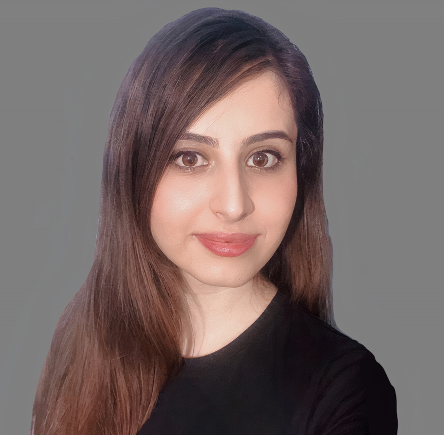

 Inanç Birol, principal investigator   
 [René Warren](https://warrenlr.github.io/), group leader   
 Lauren Coombe, assistant bioinformatics coordinator   
 Damini Chand, project manager 
 Mansi Sharma, project manager 
 Monica Kotkoff, project manager 

### Antimicrobial Research
 Anat Yanai, research associate  
 Darcy Sutherland, graduate student (UBC) 
 Chenkai Li, graduate student (UBC) 
 Hossein Ebrahimikondori, graduate student (UBC) 
 Amelia Richter, coop student (UBC) 
 Nila Erturk, summer intern (UofT) 

### Computational Biology
 Readman Chiu, production coordinator  
 Ka Ming Nip, graduate student (UBC)   
 Saber Hafezqorani, graduate student (UBC) 
 Theodora Lo, graduate student (UBC) 
 Cecilia Yang, graduate student (UBC) 
 Kyle Jenkins, graduate student (UBC) 
 Irem Yucel, graduate student (UBC) 

### High Performance Computing
 Johnathan Wong, research programmer  
 [Amirhossein Afshinfard](member/aafshinfard), graduate student (UBC) 
 Talha Murathan Goktas, graduate student (UBC) 
Parham Kazemi, graduate student (UBC) 
Armaghan Sarvar, graduate student (UBC) 
Emily Zhang, student volunteer (UBC) 
Moustafa Shokrof, graduate student 

### Alumni
Vladimir Nikolic, graduate student (UBC) / research programmer 
Janet Li, graduate student (UBC) 
Nathan Louie, coop student (UBC)  
Kristina Gagalova, graduate student (UBC)  
Diana Lin, graduate student (UBC)  
Chen Yang, graduate student (UBC) / PDF  
Puneet Sidhu, coop student (UBC) 
Rui Wang, GSAT rotation student (UBC) 
Kristina Wright, graduate student (UBC) 
Sina Jafarzadeh, (UBC directed study student) 
Sambina Islam Aninta, coop student (UBC) 
Jacky Yiu, coop student (SFU) 
Yaman Malkoc, coop student (UBC) 
Yee Fay Lim, graduate student (UBC) 
Kyle Jenkins, graduate student (UBC GSAT - rotation) 
Maria Stephenson, coop student (UBC)  
Justin Chu, graduate student (UBC) / PDF  
Figali Taho, graduate student (UBC)  
Iris Caglayan, summer intern  
Alex Marr, GSAT rotation student (UBC)  
Golnar Sheikhshab, graduate student (SFU)  
Talha Murathan Goktas, intern (Bilkent University, Turkey) 
Hamid Mohamadi, graduate student (UBC) / Research associate 
Gokce Dilek, coop student (UBC) 
Yaman Malkoc, coop student (UBC) 
Jane Lee, volunteer (UBC) 
Shaun Jackman, graduate student (UBC) / PDF  
Jessica Zhang, coop student (UBC) 
Eric Chen, honor's project student / directed studies student (UBC) 
Zhuyi Xue, computational biologist 
Sauparna Palchowdhury, research programmer 
Lieke Janssen, intern (HAN University of Applied Sciences, The Netherlands) 
S. Austin Hammond, computational biologist 
Ben Vandervalk, computational biologist 
Jeffrey Tse, coop student (UBC) 
Daniel MacMillan, computational biologist 
Emre Erhan, honours project student (UBC) 
Jessica Ma, coop student (UBC) 
Johnathan Wong, coop student (UBC) 
Ewan Gibb, staff scientist   
Hamza Khan, graduate student (UBC)   
Erdi Kucuk, graduate student (UBC)   
Sarah Yeo, honor's project student / intern / directed studies student (UBC)   
Djallel Bouneffouf, postdoctoral fellow   
Abdur Rahman M.A. Basher, graduate student 
Victoria Stuart, computational biologist 
Jessica Pilsworth, graduate student (UBC)   
Bahar Behsaz, computational biologist   
Jorge Lazo, coop student (UBC) 
Yi-Ming Sun, coop student (UVic)   
Nathan Nastilli, coop student (SFU)   
Alex Purdy, coop student (UVic)   
Karthika Raghavan, postdoctoral fellow   
Tony Raymond, computational biologist   
Albert Lagman, coop student (UBC)   
Daniel Paulino, coop student (SFU)   
Mimi Ko, coop student (UBC)   
